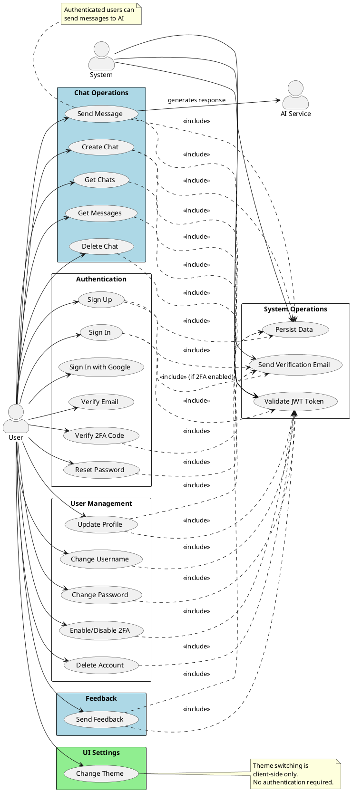
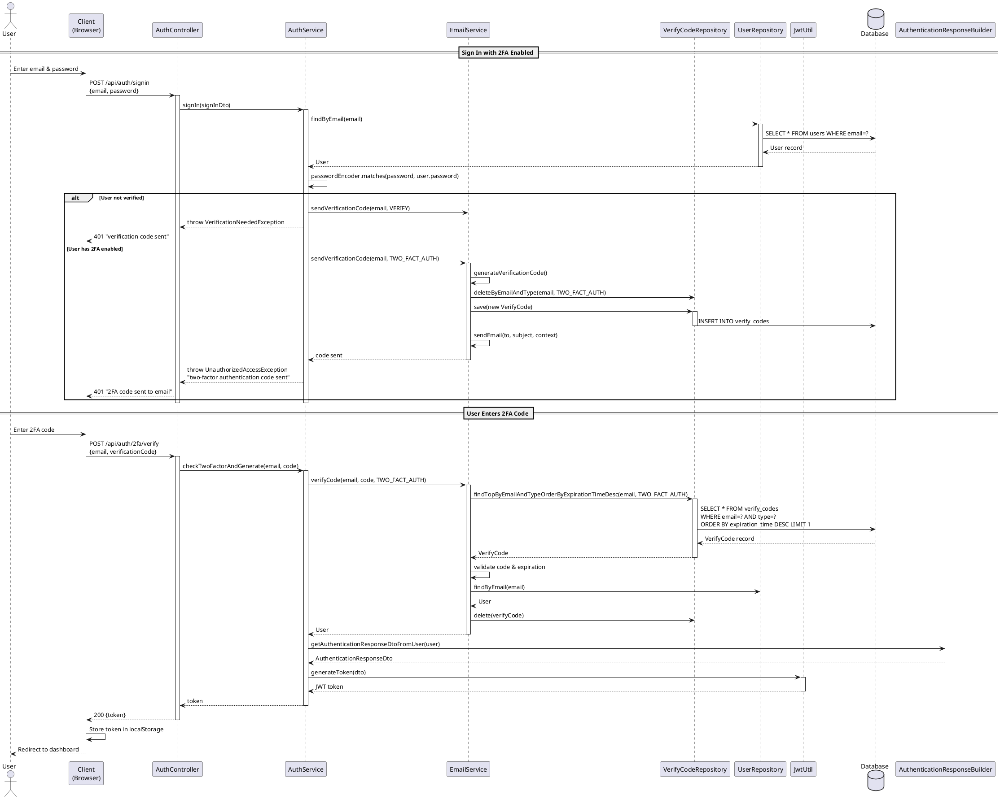
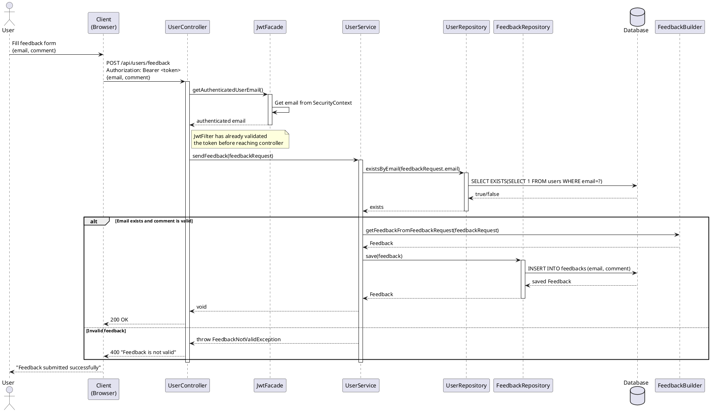
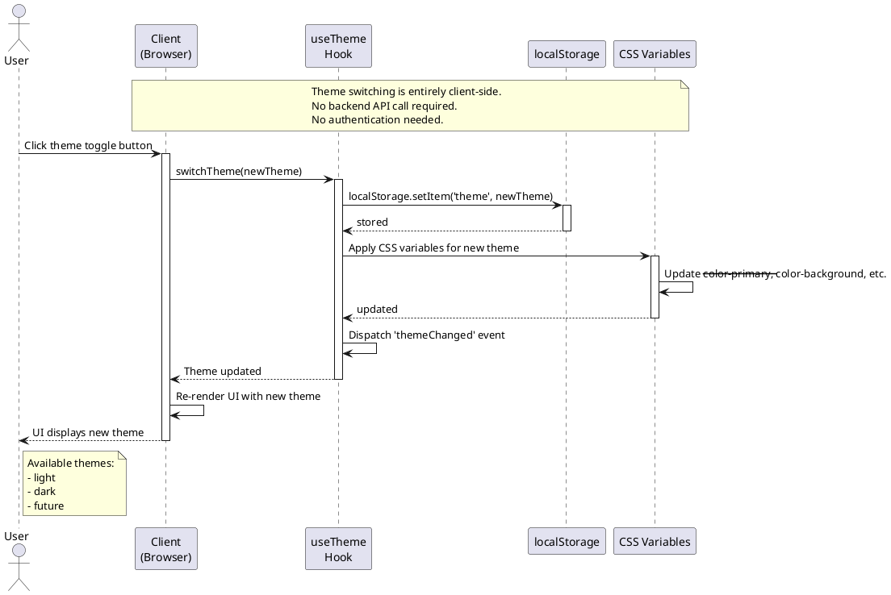
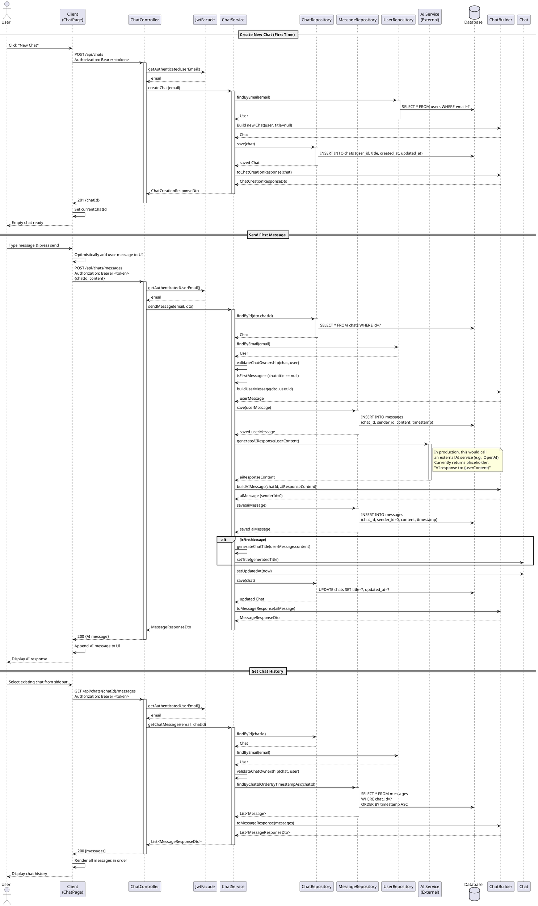

# UniAI System - UML Diagrams

> **Project:** UniAI - AI Chat Application with Authentication
> **Actors:** User, System, AI
> **Generated:** January 2, 2026

---

## Table of Contents
1. [Use Case Diagram](#1-use-case-diagram)
2. [Class Diagram](#2-class-diagram)
3. [Sequence Diagrams](#3-sequence-diagrams)
   - [3.1 Authentication with 2FA](#31-authentication-with-2fa)
   - [3.2 Feedback Submission](#32-feedback-submission-with-auth-check)
   - [3.3 Theme Change (No Auth)](#33-theme-change-no-auth)
   - [3.4 User ↔ AI Chat Interaction](#34-user--ai-chat-interaction)

---

## 1. Use Case Diagram

---

## 2. Class Diagram

```plantuml
@startuml
skinparam linetype ortho

' ============================================================
' MODELS / ENTITIES
' ============================================================
package "com.uniai.model" {
  class User {
    - id: Long
    - firstName: String
    - lastName: String
    - username: String
    - email: String
    - password: String
    - isVerified: boolean
    - isTwoFacAuth: boolean
  }

  class Chat {
    - id: Long
    - user: User
    - title: String
    - createdAt: LocalDateTime
    - updatedAt: LocalDateTime
    + onCreate(): void
    + onUpdate(): void
  }

  class Message {
    - id: Long
    - chatId: Long
    - senderId: Long
    - content: String
    - timestamp: LocalDateTime
    + onCreate(): void
  }

  class VerifyCode {
    - id: Long
    - email: String
    - code: String
    - type: VerificationCodeType
    - expirationTime: LocalDateTime
    + saveCode(email, code, type): void
  }

  class Feedback {
    - id: Long
    - email: String
    - comment: String
  }
}

' ============================================================
' ENUMS / DOMAIN
' ============================================================
package "com.uniai.domain" {
  enum VerificationCodeType {
    VERIFY
    TWO_FACT_AUTH
    CHANGE_PASSWORD
  }
}

' ============================================================
' REPOSITORIES
' ============================================================
package "com.uniai.repository" {
  interface UserRepository {
    + findByEmail(email): User
    + findByUsername(username): User
    + existsByEmail(email): boolean
    + existsByUsername(username): boolean
    + deleteByEmail(email): boolean
    + deleteByUsername(username): boolean
  }

  interface ChatRepository {
    + findByUserUsernameOrderByUpdatedAtDesc(username): List<Chat>
    + findTitleById(chatId): String
    + findById(chatId): Optional<Chat>
  }

  interface MessageRepository {
    + findByChatIdOrderByTimestampAsc(chatId): List<Message>
    + findTop10ByChatIdOrderByTimestampDesc(chatId): List<Message>
    + deleteByChatId(chatId): void
    + deleteByChatIdIn(chatIds): void
    + countByChatId(chatId): long
    + existsByChatId(chatId): boolean
  }

  interface VerifyCodeRepository {
    + deleteByEmailAndType(email, type): void
    + findTopByEmailAndTypeOrderByExpirationTimeDesc(email, type): VerifyCode
  }

  interface FeedbackRepository {
  }
}

' ============================================================
' DTOs
' ============================================================
package "com.uniai.dto" {
  class SignUpDto {
    + firstName: String
    + lastName: String
    + username: String
    + email: String
    + password: String
  }

  class SignInDto {
    + email: String
    + password: String
  }

  class VerifyDto {
    + email: String
    + verificationCode: String
  }

  class RequestPasswordDto {
    + email: String
    + verificationCode: String
    + newPassword: String
  }

  class UpdateUserDto {
    + username: String
    + firstName: String
    + lastName: String
    + enableTwoFactor: Boolean
  }

  class FeedbackRequest {
    + email: String
    + comment: String
  }

  class SendMessageDto {
    + chatId: Long
    + content: String
  }

  class ChatCreationResponseDto {
    + chatId: Long
  }

  class MessageResponseDto {
    + messageId: Long
    + chatId: Long
    + senderId: Long
    + content: String
    + timestamp: LocalDateTime
  }

  class AuthenticationResponseDto {
    + username: String
    + firstName: String
    + lastName: String
    + email: String
    + isVerified: boolean
    + isTwoFacAuth: boolean
  }

  class TokenResponse {
    + token: String
  }
}

' ============================================================
' SERVICES
' ============================================================
package "com.uniai.services" {
  class AuthService {
    - userRepository: UserRepository
    - emailService: EmailService
    - passwordEncoder: PasswordEncoder
    - jwtUtil: JwtUtil
    + signUp(signUpDto): String
    + signIn(signInDto): String
    + verifyAndGenerateToken(email, code): String
    + checkTwoFactorAndGenerate(email, code): String
    + forgetPassword(email): void
    + resetPasswordWithCode(email, code, newPassword): String
  }

  class UserService {
    - userRepository: UserRepository
    - feedbackRepository: FeedbackRepository
    - passwordEncoder: PasswordEncoder
    + getMe(email): AuthenticationResponseDto
    + updateUserProfile(email, updateDto): AuthenticationResponseDto
    + deleteCurrentUser(email, password): void
    + changePasswordForUser(email, currentPassword, newPassword): void
    + sendFeedback(feedbackRequest): void
  }

  class ChatService {
    - chatRepository: ChatRepository
    - messageRepository: MessageRepository
    - userRepository: UserRepository
    + createChat(email): ChatCreationResponseDto
    + sendMessage(email, dto): MessageResponseDto
    + getUserChats(email): List<Chat>
    + getChatMessages(email, chatId): List<MessageResponseDto>
    + deleteChat(email, chatId): void
    + deleteAllChats(email): void
    - generateAIResponse(userContent): String
    - generateChatTitle(firstMessageContent): String
  }

  class EmailService {
    - mailSender: JavaMailSender
    - templateEngine: TemplateEngine
    - verifyCodeRepository: VerifyCodeRepository
    - userRepository: UserRepository
    + sendVerificationCode(email, type): String
    + verifyCode(email, code, type): User
  }

  class OAuthGoogleService {
    - userRepository: UserRepository
    - jwtUtil: JwtUtil
    + getGoogleAuthorizationUrl(): String
    + processGoogleCallback(code): String
  }
}

' ============================================================
' CONTROLLERS
' ============================================================
package "com.uniai.controller" {
  class AuthController {
    - authService: AuthService
    - oAuthGoogleService: OAuthGoogleService
    + signUp(signUpDto): ResponseEntity
    + signIn(signInDto): ResponseEntity
    + verifyCode(verifyDto): ResponseEntity
    + verifyTwoFactor(verifyDto): ResponseEntity
    + forgetPassword(emailDto): ResponseEntity
    + confirmForgetPassword(dto): ResponseEntity
    + getGoogleAuthUrl(request): ResponseEntity
  }

  class UserController {
    - userService: UserService
    - jwtFacade: JwtFacade
    + getMe(): ResponseEntity
    + updateMe(updateDto): ResponseEntity
    + deleteMe(dto): ResponseEntity
    + changePassword(dto): ResponseEntity
    + sendFeedback(entity): ResponseEntity
  }

  class ChatController {
    - chatService: ChatService
    - jwtFacade: JwtFacade
    + createChat(): ResponseEntity
    + sendMessage(dto): ResponseEntity
    + getUserChats(): ResponseEntity
    + getChatMessages(chatId): ResponseEntity
    + deleteChat(chatId): ResponseEntity
    + deleteAllChats(): ResponseEntity
  }
}

' ============================================================
' SECURITY
' ============================================================
package "com.uniai.security.jwt" {
  class JwtUtil {
    + generateToken(dto): String
    + validateToken(token): boolean
    + getUserDtoFromToken(token): AuthenticationResponseDto
  }

  class JwtFilter {
    - jwtUtil: JwtUtil
    + doFilterInternal(request, response, chain): void
  }

  class JwtFacade {
    + getAuthenticatedUserEmail(): String
  }
}

' ============================================================
' BUILDERS
' ============================================================
package "com.uniai.builder" {
  class ChatBuilder {
    + {static} toChatCreationResponse(chat): ChatCreationResponseDto
    + {static} toMessageResponse(message): MessageResponseDto
    + {static} buildUserMessage(dto, userId): Message
    + {static} buildAIMessage(chatId, content): Message
  }

  class AuthenticationResponseBuilder {
    + {static} getUserFromSignUpDto(dto, encoder): User
    + {static} getAuthenticationResponseDtoFromUser(user): AuthenticationResponseDto
  }

  class FeedbackBuilder {
    + {static} getFeedbackFromFeedbackRequest(request): Feedback
  }
}

' ============================================================
' RELATIONSHIPS - MODELS
' ============================================================
User "1" -- "0..*" Chat : owns >
VerifyCode --> VerificationCodeType : uses

' ============================================================
' RELATIONSHIPS - REPOSITORIES
' ============================================================
UserRepository --|> JpaRepository
ChatRepository --|> JpaRepository
MessageRepository --|> JpaRepository
VerifyCodeRepository --|> JpaRepository
FeedbackRepository --|> JpaRepository

' ============================================================
' RELATIONSHIPS - SERVICES
' ============================================================
AuthService --> UserRepository
AuthService --> EmailService
AuthService --> JwtUtil
UserService --> UserRepository
UserService --> FeedbackRepository
ChatService --> ChatRepository
ChatService --> MessageRepository
ChatService --> UserRepository
EmailService --> VerifyCodeRepository
EmailService --> UserRepository
OAuthGoogleService --> UserRepository
OAuthGoogleService --> JwtUtil

' ============================================================
' RELATIONSHIPS - CONTROLLERS
' ============================================================
AuthController --> AuthService
AuthController --> OAuthGoogleService
UserController --> UserService
UserController --> JwtFacade
ChatController --> ChatService
ChatController --> JwtFacade

' ============================================================
' RELATIONSHIPS - SECURITY
' ============================================================
JwtFilter --> JwtUtil
JwtFacade --> SecurityContextHolder

' ============================================================
' RELATIONSHIPS - BUILDERS
' ============================================================
ChatService --> ChatBuilder
AuthService --> AuthenticationResponseBuilder
UserService --> FeedbackBuilder

note right of Message
  senderId = 0 means AI
  senderId > 0 means User
end note

note right of Chat
  title is NULL until
  first message is sent
end note

note bottom of ChatService
  generateAIResponse() is a
  placeholder for actual AI
  integration
end note

@enduml
```

---

## 3. Sequence Diagrams

### 3.1 Authentication with 2FA

---

### 3.2 Feedback Submission (with Auth Check)

---

### 3.3 Theme Change (No Auth)

---

### 3.4 User ↔ AI Chat Interaction

---

## Notes

### Authentication Flow
- **Sign Up:** User registers → Email verification code sent → User verifies → JWT token issued
- **Sign In:** User logs in → If 2FA enabled → 2FA code sent → User verifies 2FA → JWT token issued
- **Google OAuth:** User clicks Google login → Redirected to Google → Returns with code → Backend exchanges code for user info → JWT token issued

### Authorization
- **Protected Endpoints:** All `/api/users/*` and `/api/chats/*` endpoints require valid JWT token
- **JwtFilter:** Validates token on every request and populates SecurityContext
- **JwtFacade:** Provides clean abstraction to get authenticated user's email from SecurityContext

### AI Integration
- Currently, `ChatService.generateAIResponse()` returns a placeholder
- In production, this should integrate with external AI service (e.g., OpenAI, Anthropic)
- Message with `senderId = 0` indicates AI response
- Message with `senderId > 0` indicates user message

### Theme Management
- Entirely client-side operation
- No backend API or authentication required
- Stored in browser's localStorage
- Supports: light, dark, future themes

### Data Persistence
- **User:** Stored in `users` table
- **Chat:** Stored in `chats` table with foreign key to user
- **Message:** Stored in `messages` table with chatId reference
- **VerifyCode:** Temporary codes for email verification (VERIFY, TWO_FACT_AUTH, CHANGE_PASSWORD)
- **Feedback:** Stored in `feedbacks` table

---

**End of UML Diagrams Document**
